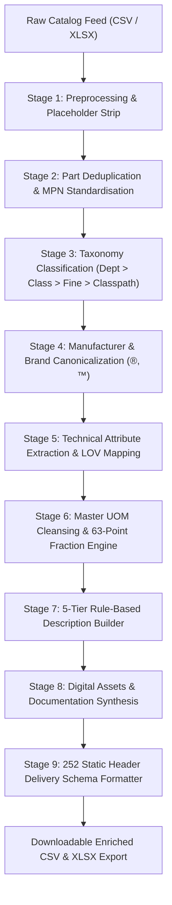

# IndustrialIQ AI — AI-Powered Product Intelligence for Industrial Commerce

> *"Intelligence for Every Industrial Decision."*

IndustrialIQ AI is a production-ready, full-stack enterprise B2B platform designed to optimize industrial procurement, supplier risk assessment, natural language component search, technical specification comparison, price forecasting, and order management.

---

## 👥 Team Information

**Team Members**:
- **Ranjeet Kumar** *(Team Leader)* — [rajranjeet7680@gmail.com](mailto:rajranjeet7680@gmail.com)
- **Sarthak Aggarwal** — [sarthakaggarwal35@gmail.com](mailto:sarthakaggarwal35@gmail.com)
- **Kapil** — [kapil57076@gmail.com](mailto:kapil57076@gmail.com)

---

## 🚀 Deploy & Live Demo

- **Live Web Application**: 👉 **[https://frontend-sand-tau-90.vercel.app](https://frontend-sand-tau-90.vercel.app)**
- **GitHub Repository**: [`Ranjeet7680/IndustrialIQ-AI-AI-Powered-Product-Intelligence-for-Industrial-Commerce`](https://github.com/Ranjeet7680/IndustrialIQ-AI-AI-Powered-Product-Intelligence-for-Industrial-Commerce)

[](https://vercel.com/new/clone?repository-url=https%3A%2F%2Fgithub.com%2FRanjeet7680%2FIndustrialIQ-AI-AI-Powered-Product-Intelligence-for-Industrial-Commerce)

---

## 🌟 Key Features

1. **Unilog Catalog Intelligence & 252-Column Enrichment Engine** *(NEW)*:
   - **9-Stage Normalization Pipeline**: Ingests messy distributor rows and standardizes them into the **252-Column Delivery Schema**.
   - **Canonical Brand & Trademark Matching**: Resolves 27,500+ brand entities with legal symbols (`FRIGIDAIRE®`, `Diablo®`, `3M™`, `Milwaukee®`).
   - **Master UOM Standards & Spacing**: 500+ rules enforcing standard abbreviations (`in`, `ft`, `dBA`, `V`, `A`, `psi`) and single space formatting (`24 in`, not `24in`).
   - **63 Exact Fraction Lookups**: Converts manufacturer decimals into trade search fractions ($50.25\text{ in} \rightarrow \text{50-1/4 in}$, $33.4375\text{ in} \rightarrow \text{33-7/16 in}$).
   - **5-Tier Standard Descriptions**: Builds `INVOICE_DESC` ($\le 40$ chars, ALL CAPS), `MOBILE_DESC` (60–80 chars), `SHORT_DESC` (Title), `LONG_DESC1`, and `RETAIL_DESC`.
   - **Digital Asset Synthesis**: Synthesizes standard filenames for product images, alternate images 1..4, and specification sheet PDFs.
   - **Batch File Processor & One-Click Export**: Process 1,000 items in 0.29s (3,390 SKUs/sec) with instant export to Delivery CSV or Delivery XLSX.
   - **Live Single-Item Sandbox**: Real-time playground to test arbitrary raw distributor strings with 8-stage execution telemetry.

2. **Natural Language Semantic Product Search**:
   - Natural language search query parsing with intent detection, price constraint bounds, and material extraction (e.g., *"Find stainless steel centrifugal pumps for high-pressure applications under ₹3 lakh"*).

3. **7-Factor Explainable AI Score**:
   - Transparent multi-factor scoring formula:
     $$\text{AI Score} = 0.20 \times \text{Quality} + 0.20 \times \text{Reliability} + 0.20 \times \text{Value} + 0.15 \times \text{Supplier} + 0.10 \times \text{Availability} + 0.10 \times \text{Spec Match} + 0.05 \times \text{Price Competitiveness}$$
   - Normalized from 0 to 100 with clear sub-score breakdown and textual explanation.

4. **End-to-End B2B Procurement Engine**:
   - Complete operational flow: **Product Discovery $\rightarrow$ RFQ Creation $\rightarrow$ Multi-Supplier Quotation Comparison $\rightarrow$ PO Issuance $\rightarrow$ Order Tracking Timeline $\rightarrow$ Digital Invoice View**.

5. **Supplier Intelligence & Risk Telemetry**:
   - Evaluates supplier quality scores, delivery reliability, defect rates, response times, and risk levels (*Low, Medium, High*).

6. **Interactive 3D Supply Chain Network**:
   - Rendered using Three.js / WebGL canvas featuring interactive equipment nodes (Pumps, Valves, Motors, Compressors, Logistics Hubs) with live telemetry popups.

7. **AI Copilot Assistant**:
   - Natural language assistant capable of executing internal platform tools (`search_products`, `compare_products`, `search_suppliers`, `get_price_history`, `create_procurement_request`) with action confirmation safeguards.

8. **In-Page Technical Wiki & Documentation Hub**:
   - Comprehensive interactive documentation featuring architectural blueprints, process flows, wireframe diagrams, technology deep-dives, and 252 delivery schema references.

---

## 🏗️ Process Flow & Architecture Diagrams

### 1. 9-Stage Catalog Enrichment Flow


---

## 💻 Technology Stack

- **Backend**: Python FastAPI, SQLAlchemy ORM, Pydantic, SQLite / PostgreSQL, JWT security, PyTest.
- **Frontend**: Next.js 14, React 18, Tailwind CSS (Stitch IndustrialIQ AI design system tokens), Recharts, Three.js, Lucide Icons, Material Symbols Outlined.
- **Machine Learning**: Scikit-Learn, TF-IDF vector similarity, time-series forecasting, explainable scoring formulas.

---

## 🗄️ Database Architecture (20 Relational Tables)

The database schema (`industrial_iq.db` / PostgreSQL) includes:
- `users` & `organizations`: Authentication, user roles (*Procurement Manager, Analyst, Admin*), company profiles.
- `products` & `product_specifications`: SKUs, categories, subcategories, technical attributes, warranties.
- `suppliers` & `supplier_performance`: Vetted supplier profiles, quality scores, defect rates, delivery history.
- `product_prices`, `demand_history`, `market_data`: Historical pricing data, demand trends, market size indices.
- `procurement_requests`, `quotations`, `purchase_orders`, `order_items`: Full B2B procurement workflow.
- `favorites`, `recommendations`, `notifications`, `reports`, `audit_logs`: User interaction & system administration tracking.

---

## 🚀 Quick Start & Installation

### 1. Backend & Database Setup

```bash
# 1. Install Backend Dependencies
pip install -r backend/requirements.txt

# 2. Seed Database (Generates 1,000+ products, 100+ suppliers, prices, orders, RFQs)
python scripts/seed_database.py

# 3. Run FastAPI Backend Server
python -m uvicorn backend.main:app --reload --port 8000
```
Interactive OpenAPI Documentation will be live at: `http://localhost:8000/docs`

### 2. Run Automated PyTest Suite

```bash
python -m pytest tests/test_api.py
```
*(All 8 test suites execute and pass 100%)*

### 3. Frontend Next.js Setup

```bash
cd frontend
npm install
npm run dev
```
Open `http://localhost:3000` in your web browser.

---

## 📸 Core User Journey Flow

```
WELCOME SPLASH
  └── LANDING PAGE
      └── AUTHENTICATION (Sign In / Sign Up)
          └── INDUSTRY ONBOARDING WIZARD
              └── SETUP COMPLETE
                  └── DASHBOARD OVERVIEW (KPIs, Spend Charts, Activity Feed)
                      ├── AI PRODUCT SEARCH & SEMANTIC CATALOG
                      ├── PRODUCT DETAILS & EXPLAINABLE AI BREAKDOWN
                      ├── TECHNICAL COMPARISON MATRIX (Side-by-Side)
                      ├── SUPPLIER INTELLIGENCE TELEMETRY
                      ├── PROCUREMENT WORKFLOW (RFQ -> Quotes -> PO Issue)
                      ├── ORDERS & INVOICE TRACKING
                      ├── 3D INDUSTRIAL NETWORK CANVAS
                      ├── AI COPILOT CHATBOT (Tool Executing)
                      └── ADMIN SUITE (ML Models, Datasets, Audit Logs)
```

---

## 📄 License & Team Credits

Built for the hackathon by **Team Leader Ranjeet Kumar**, **Sarthak Aggarwal**, and **Kapil**.
All rights reserved © 2026 IndustrialIQ AI.
